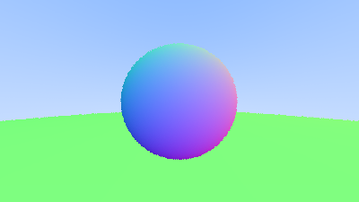
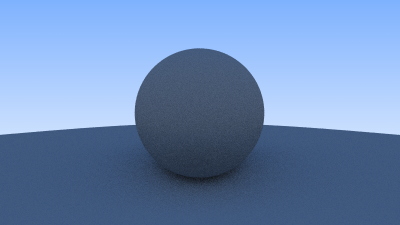
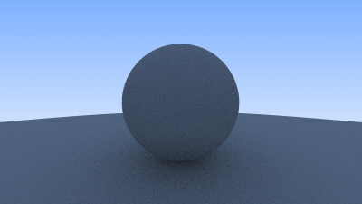
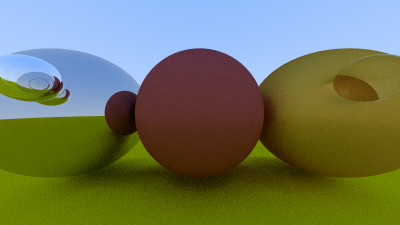
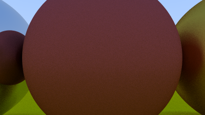
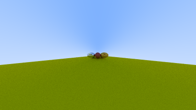

## Cuda randon numbers

At this state of the development the ray tracer is pretty simple but I managed to calculate each pixel color of the image in the GPU.

In the next step I would perform antialasing, to do so the color on each pixel will be calculated by launching several rays in the soroundings of the pixel coordinated and later average of all the samples.

To decide the direction of the ray, we will use the folowing function:
```c++
#include <random>

float random_float() {
    static std::uniform_real_distribution<float> distribution(0.f, 1.f);
    static std::mt19937 generator;
    return distribution(generator);
}
```

Then this function can not be called from the device, so we need another way to generate random numbers in the device. I am going to use the cuRAND library. The function `curand_uniform(curandState_t* state)` generates a sequence of pseudorandom floats uniformly distributed between 0.0 and 1.0 (same as random_float). First, I allocate a curandState_t for each of the pixels in the image, and then use this function using the local state.

This kernel is used to set the curandState on each thread:
```c++
#include "curand_kernel.h"

#define NUM_SAMPLES 100
#define D_SEED 1234

__global__ void setupKernel(curandState* state, int width, int height)
{
  int x = blockDim.x * blockIdx.x + threadIdx.x;
  int y = blockDim.y * blockIdx.y + threadIdx.y;
  if (x >= width || y >= height)
    return;
  int pixel_idx = y * width + x;
  // Each thread gets same seed, different suquence, no offset
  curand_init(D_SEED, pixel_idx, 0, &state[pixel_idx]);
}
```

The local curandState is used on each thread to calculate the color

```c++
__global__ void render(Vec3* const pixel_color,
                       Vec3 look_from,
                       int width,
                       int height,
                       Vec3 horizontal,
                       Vec3 vertical,
                       float focal_length,
                       Hittable** world,
                       curandState* d_state)
{
  ...

  int pixel_idx = y * width + x;

  curandState local_state = d_state[pixel_idx];

  for (int i = 0; i < NUM_SAMPLES; i++)
  {
    float u = float((x + curand_uniform(&local_state))) / (float)(width - 1);
    float v = float((y + curand_uniform(&local_state))) / (float)(height - 1);
    ...
    auto tmp_color = getColor(ray, world);
    // Average color
    const float scale = 1.f / (float)NUM_SAMPLES;
    tmp_color *= scale;

    color += tmp_color;
  }
  pixel_color[pixel_idx] = color;
}


int main(int argc, char const* argv[])
{
  ...
  
  dim3 blockSize(THREADS_PER_BLOCK, THREADS_PER_BLOCK, 1);
  dim3 gridSize(ceil(w / (float)THREADS_PER_BLOCK), ceil(h / (float)THREADS_PER_BLOCK));

  // Randon numbers
  curandState* d_states;
  cudaMalloc((void**)&d_states, sizeof(d_states) * w * h);

  setupKernel<<<gridSize, blockSize>>>(d_states, w, h);
}
```

This is the result with 1 samples per pixel


This is the result with 100 samples per pixel


The result with 200 samples per pixel


After the antialiasing I would cover material.

Diffuse materials reflect the light in a random direction and also could absorb part of the ligh, the more darker is the material the more light it absorbs. This involves to have new rays scattered every time a ray hit an object in the scene. This leads to recursion in the device function that returns the color of the pixel. As CUDA has a small stack to recursively call a function I would use a for loop to generate after each hit a new ray that will be used to compute new world interactions. 

For this initial state the diffuse material will absorb half of the ray light, and the new direction will be calculated by two approaches:
 * For the first one I get a random point using spherical coordinates which tends to return more points around the poles

```c++
__device__ Vec3 getRandomInUnitSpehere(curandState* local_state)
{
  float r1 = curand_uniform(local_state);
  float r2 = curand_uniform(local_state);
  float phi = CURAND_2PI * r1;
  float theta = r2 * (float)CURAND_PI_DOUBLE / 2.f;
  float x = cosf(phi) * sinf(theta);
  float y = sinf(phi) * sinf(theta);
  float z = cosf(theta);
  return Vec3(x, y, z);
}
```


 * The second approach I used the idea of the solid angle
```c++ 
// Return a unit vector in the same hemisphere that the normal
__device__ Vec3 getRandomUnitVectorInHemispehere(curandState* local_state, const Vec3& normal)
{
  float r1 = curand_uniform(local_state);
  float r2 = curand_uniform(local_state);
  float phi = CURAND_2PI * r1;
  float x = cosf(phi) * sqrtf(1.f - r2 * r2);
  float y = sinf(phi) * sqrtf(1.f - r2 * r2);
  float z = r2;
  Vec3 v(x, y, z);
  v.make_unit_vector();
  if (dot(normal, v) > .0f)
    return v;
  return -v;
}
```


The first approach gives more noise, so I will chose the second one for now.

This leads to the getColor function:

```c++
__device__ Vec3 getColor(const Ray& r, Hittable** world, curandState* local_state)
{
  float cur_attenuation = 1.0f;
  Ray ray = r;
  for (int i = 0; i < MAX_RAYS; i++)
  {
    HitRecord hit_record;
    // 0.001f Fixing Shadow Acne
    if ((*world)->hit(ray, 0.001f, FLT_MAX, hit_record))
    {
      Vec3 target = hit_record.p + getRandomUnitVectorInHemispehere(local_state, hit_record.normal);
      ray = Ray(hit_record.p, target - hit_record.p);
      cur_attenuation *= 0.5f;
    }
    else
    {
      float t = 0.5f * (ray.direction().y() + 1.f);
      Vec3 f_color = Vec3(1.f, 1.f, 1.f) * (1.f - t) + Vec3(0.5f, 0.7f, 1.f) * t;
      return f_color * cur_attenuation;
    }
  }
  // After MAX_RAYS there is no light at all => dark
  return Vec3{0.f, 0.f, 0.f};
}
```
# REFLECTION AND REFRACTION
To model the material we introduce a material pointer inside the HitRecord structure. This points to the current object being hit, so later on the new ray directionis calculated by a new method inside the material interface
```c++

class Material
{
public:
  __device__ virtual bool scatter(const Ray& ray,
                                  const HitRecord& hit_record,
                                  Vec3& attenuation,
                                  Ray& scattered,
                                  curandState* local_state) const = 0;
};
```
The scatter functions takes the incoming ray, the hit info and the local_state to use the random functions.
The in/out parameters attenuation depends on the specific implementation of the material.

The Lambertian material has a color property that is returned as the attenuation value in the scattered method, this value could be reduced by a probability so the reflected ray has the material color with a random attenuation. The reflected direction as discussed previously.
```c++

class Lambertian: public Material
{
  ...

  __device__ virtual bool scatter(const Ray& ray,
                                  const HitRecord& hit_record,
                                  Vec3& attenuation,
                                  Ray& scattered,
                                  curandState* local_state) const override
  {
    Vec3 scatter_direction = hit_record.p + hit_record.normal + getRandomInUnitSpehere(local_state);
    if (scatter_direction.near_zero())
      scatter_direction = hit_record.normal;
    scattered = Ray(hit_record.p, scatter_direction);
    float scatter_probability = getRandom(local_state);
    attenuation = albedo_*scatter_probability;
    return true;
  }
};
```
The Metal material just reflects the light. For a fuzzy reflection we can use a parameter to model the radius of a sphere to shift the direction of the reflected ray, for a perfect reflection a zero radius is selected. The bigger the fuzziness the lesser the perfect reflection

```c++
class Metal: public Material
{
private:
  Vec3 albedo_;
  float fuzzy_;

public:
  __device__ Metal(const Vec3& color, float fuzzy): albedo_{color}
  {
    fuzzy_ = fuzzy >= 0.f ? fuzzy : 1.f;
  }
  __device__ virtual bool scatter(const Ray& ray,
                                  const HitRecord& hit_record,
                                  Vec3& attenuation,
                                  Ray& scattered,
                                  curandState* local_state) const override
  {
    Vec3 reflected = reflect(unit_vector(ray.direction()), hit_record.normal);
    scattered = Ray(hit_record.p, reflected + fuzzy_ * getRandomInUnitSpehere(local_state));
    float scatter_probability = getRandom(local_state);
    attenuation = albedo_;
    return dot(reflected, hit_record.normal) > 0.f;
  }
};

```

For Dielectrics like water, glass or diamons, the part of the ray is reflected and part pass from one material to another (refraction). For now we handle only one ray at the time, so the scattered ray would be either the reflected or the transmitted: the choice is randomly assigned. One important concept here is the total internal reflection, i.e. if the direction of a ray is such that the refracted ray does not penetrate from one material to the other, this could happen from material with higher refractive index. As the result the ray in reflected back inside the material. 
Additionaly the glass could behave like a mirror from really steep angles, fot these situation the ray should be reflected not refracted.

```c++
class Dielectric: public Material
{
private:
  float index_of_refraction_;

public:
  __device__ Dielectric(float index_of_refraction): index_of_refraction_{index_of_refraction} {}
  __device__ virtual bool scatter(const Ray& ray,
                                  const HitRecord& hit_record,
                                  Vec3& attenuation,
                                  Ray& scattered,
                                  curandState* local_state) const override
  {
    auto refr_ratio = hit_record.front_face ? (1.0f / index_of_refraction_) : index_of_refraction_;
    auto unit_ray = unit_vector(ray.direction());
    float cos_theta = fminf(dot(-unit_ray, hit_record.normal), 1.0f);
    auto sin_theta = sqrtf(1.f - cos_theta * cos_theta);
    Vec3 direction;
    bool cannot_refract = refr_ratio * sin_theta > 1.f;
    // Randomly choose between fraction and reflection
    if (cannot_refract || reflectance(cos_theta, refr_ratio) > getRandom(local_state))
    {
      // Must reflect
      direction = reflect(unit_ray, hit_record.normal);
    }
    else
    {
      // can refract
      direction = refract(unit_ray, hit_record.normal, refr_ratio);
    }
    scattered = Ray(hit_record.p, direction);
    attenuation = Vec3{1.f, 1.f, 1.f};
    return true;
  }
};
```

For the following image a value of 0 is choosen for the left sphere and 0.6 for the right one.



# CAMERA
Our camera relays on the vertical field of view, this angle gives us the viewport height and therefore the distance to the image from the camera origin. Wider angles gives the more distance to the target, meanwhile lower angles are like a tele lens




For implementing a focus deblur we will move the origin of the camera used to calculate the rays. This shift is random asigned regarding the aperture of the lens.


